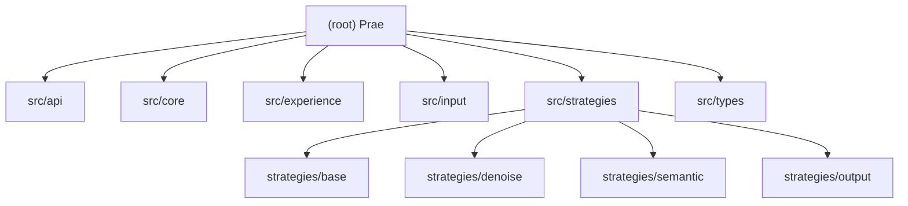

# Prae — Intelligent Noise Removal + Semantic Extraction Platform

**Version:** 0.1.0
**Generated:** 2026-04-23T16:11:05

---

## Changelog

### 2026-04-23 — Initial scan
- Root CLAUDE.md and module CLAUDE.md files generated
- Full project inventory completed (Phase A/B/C)
- Coverage report: 21 source files, 26 test files, 80% coverage threshold enforced

### 2026-06-03 — Experience persistence
- `LocalExperienceStore` gained optional JSON file persistence
- Default API feedback storage now survives server restarts via `data/experience-store.json`
- `PRAE_EXPERIENCE_STORE_PATH` can override the runtime persistence file

### 2026-06-05 - Documentation alignment
- API, Core, and Experience module docs now describe the persisted feedback loop
- Removed stale notes that claimed the feedback route schema was not exported
- Clarified that feedback can be persisted and reloaded by `contentItemId`

### 2026-06-05 - Experience read API
- Added `GET /api/v1/experience` for reading recent or learnable local experience records
- Added `LocalExperienceStore.getRecords()` with filters for `recent`, `learnable`, `tenantId`, `sourceType`, `outcome`, and `limit`
- Feedback write behavior remains unchanged; persisted records can now be read back through the API

### 2026-07-14 - Pipeline correctness alignment
- DENOISE and SEMANTIC transforms run sequentially, with each successful transform projected into the next strategy input
- Confidence is calculated from the canonical transformed state before JSON/Markdown rendering
- Retries require an explicit `RetryPolicy`; `maxRetries` caps added attempts
- Short multilingual text is retained by semantic filtering and sentence splitting supports common CJK punctuation
- Feedback by `contentItemId` targets the newest terminal attempt and returns a boolean; the API maps `false` to 404
- `startServer()` returns a `StartedServer` handle with an idempotent asynchronous `close()` contract

---

## Project Vision

Prae is an **intelligent noise removal + semantic extraction platform** that transforms raw HTML/content into LLM-friendly JSON/Markdown. It uses a multi-strategy pipeline approach with pluggable input sources, denoise/semantic/output strategies, confidence scoring, and local experience storage for learning.

**Target users:** AI Agent developers, RAG system builders, data engineers, LLM application teams.

---

## Architecture Overview



---

## Module Index

| Module | Path | Responsibility | Language |
|--------|------|---------------|----------|
| **API** | `src/api/` | REST API layer (Express) — routes, middleware, validation | TypeScript |
| **Core** | `src/core/` | Pipeline orchestrator, ConfidenceScorer | TypeScript |
| **Experience** | `src/experience/` | ExperienceStore for learning from processing results | TypeScript |
| **Input** | `src/input/` | InputSource plugin system (HTMLInputSource) | TypeScript |
| **Strategies** | `src/strategies/` | Strategy base + denoise/semantic/output strategies | TypeScript |
| **Types** | `src/types/` | Shared TypeScript interfaces | TypeScript |

---

## Directory Tree

```
src/
├── api/                    # REST API layer
│   ├── index.ts            # Entry point (starts server)
│   ├── server.ts           # Express app factory
│   ├── routes.ts           # Route definitions (/process, /strategies, /experience, /experience/feedback)
│   ├── middleware/auth.ts  # API key auth middleware
│   └── validators/process.ts # Zod schemas for request validation
├── core/                   # Core pipeline
│   ├── Pipeline.ts         # Main orchestrator (DENOISE→SEMANTIC→OUTPUT)
│   └── ConfidenceScorer.ts # Confidence scoring with thresholds
├── experience/             # Learning system
│   ├── ExperienceRecord.ts # Record type definitions
│   └── ExperienceStore.ts  # Local store with optional JSON persistence
├── input/                  # Input source plugins
│   ├── InputSource.ts      # Base interface
│   ├── HTMLInputSource.ts  # HTML parser (jsdom)
│   └── InputRegistry.ts    # Source registry + MIME detection
├── strategies/             # Strategy plugins
│   ├── base/
│   │   ├── Strategy.ts         # Base interface (id, name, type, execute)
│   │   ├── StrategyRegistry.ts  # Registry with priority/type queries
│   │   └── StrategyExecutor.ts # Execution engine + result fusion
│   ├── denoise/
│   │   ├── HTMLCleanStrategy.ts       # Removes scripts, styles, ads, nav
│   │   └── NavigationFilterStrategy.ts # Removes nav/header/footer/aside
│   ├── semantic/
│   │   ├── ChunkingStrategy.ts        # Sentence-based chunking (512 char target)
│   │   └── RelevanceFilterStrategy.ts  # Paragraph filtering + dedup (Jaccard)
│   └── output/
│       ├── JSONSchemaStrategy.ts  # Structured JSON output
│       └── MarkdownStrategy.ts     # Markdown output with title heading
└── types/
    └── index.ts            # ContentItem, ProcessingResult, ConfidenceScore, etc.

tests/
├── unit/                   # Jest unit tests
│   ├── api/routes.test.ts
│   ├── core/Pipeline.test.ts, ConfidenceScorer.test.ts
│   ├── experience/ExperienceStore.test.ts
│   ├── input/HTMLInputSource.test.ts
│   └── strategies/StrategyExecutor.test.ts, denoise.test.ts, semantic.test.ts, output.test.ts
└── e2e/
    └── processing.spec.ts  # Playwright E2E tests

docs/superpowers/
├── specs/2026-04-22-prae-design.md   # Full design specification
└── plans/2026-04-22-prae-mvp.md      # MVP implementation plan
```

---

## Running & Development

### Install dependencies
```bash
npm install
```

### Build
```bash
npm run build   # tsc → dist/
```

### Run
```bash
npm start       # node dist/api/index.js (default port 3000)
```

### Test
```bash
npm test              # Jest unit tests + default 80% global coverage gate
npx playwright test   # Playwright E2E tests
```

On managed Windows sandboxes, Playwright server cleanup may need an elevated run because its shutdown path invokes `taskkill`; this is an environment permission constraint, not an application test failure.

### Lint
```bash
npm run lint    # tsc --noEmit
```

---

## Test Strategy

- **Framework:** Jest (unit) + Playwright (E2E)
- **Coverage threshold:** 80% (branches, functions, lines, statements)
- **Unit tests:** 12 Jest test files covering all modules
- **E2E tests:** 3 Playwright cases covering processing, auth, and strategy listing
- **Test config:** `jest.config.js` maps `src/` and `tests/` roots with `ts-jest` preset
- **E2E config:** `playwright.config.ts` targets `http://localhost:3000`

---

## Coding Standards

- **Language:** TypeScript 5.3, strict mode, ES2022 target
- **Module system:** CommonJS (Node.js)
- **Immutability:** Strategies return new objects; Pipeline merges output without mutation
- **Error handling:** All async execute() calls wrapped in try/catch, returning `StrategyExecution` with `success: false`
- **Naming:** camelCase (variables/functions), PascalCase (types/interfaces/classes)
- **Strategy interface:** `canApply(item)` guards `execute(item)`; both must be implemented

---

## AI Usage Guidelines

- Use **planner** agent for feature implementation planning
- Use **code-reviewer** agent after writing code
- Use **tdd-guide** agent for new features (write tests first)
- Use **security-reviewer** agent before commits involving auth/input validation
- Refer to `C:/Users/17775/.claude/rules/` for full skill set

---

## Design Docs

- **Project overview:** `docs/project-overview.md`
- **Full design:** `docs/superpowers/specs/2026-04-22-prae-design.md`
- **MVP plan:** `docs/superpowers/plans/2026-04-22-prae-mvp.md`

---

## Implementation Notes

### Recently addressed

1. `feedbackRequestSchema` is exported from `src/api/validators/process.ts`.
2. `apiKeyAuth()` is used as a middleware factory and matches the implementation in `src/api/middleware/auth.ts`.
3. `/api/v1/process` uses `InputRegistry` / `HTMLInputSource` for parsing and returns `contentItemId`.
4. Pipeline runs DENOISE and SEMANTIC transforms sequentially, computes confidence from their canonical state, then renders OUTPUT strategies; `filteredText` and `chunks` reach renderers.
5. `/api/v1/experience/feedback` writes feedback to the newest matching attempt by `contentItemId` and returns 404 when no record matches.
6. `LocalExperienceStore` supports optional JSON persistence; the default API store writes to `data/experience-store.json`, or `PRAE_EXPERIENCE_STORE_PATH` when set.
7. `GET /api/v1/experience` reads recent or learnable experience records from the configured `ExperienceStore`.
8. Low-confidence retries are opt-in through `RetryPolicy`; `maxRetries` limits added attempts rather than enabling retries itself.
9. Short multilingual semantic content is supported, including common CJK sentence punctuation.

### Remaining gaps

1. **API `index.ts` entry** — `src/api/index.ts` is the server entry, not `src/api/server.ts` as the MVP plan intended.
2. **No `.env` / env-based config** — API key still falls back to `dev-api-key` in `auth.ts`; production should require explicit configuration.
3. **No CI/CD pipeline** — `.github/workflows/` is not present.
4. **Input coverage** — currently focused on HTML; document, audio, and enterprise knowledge sources remain design-stage capabilities.
