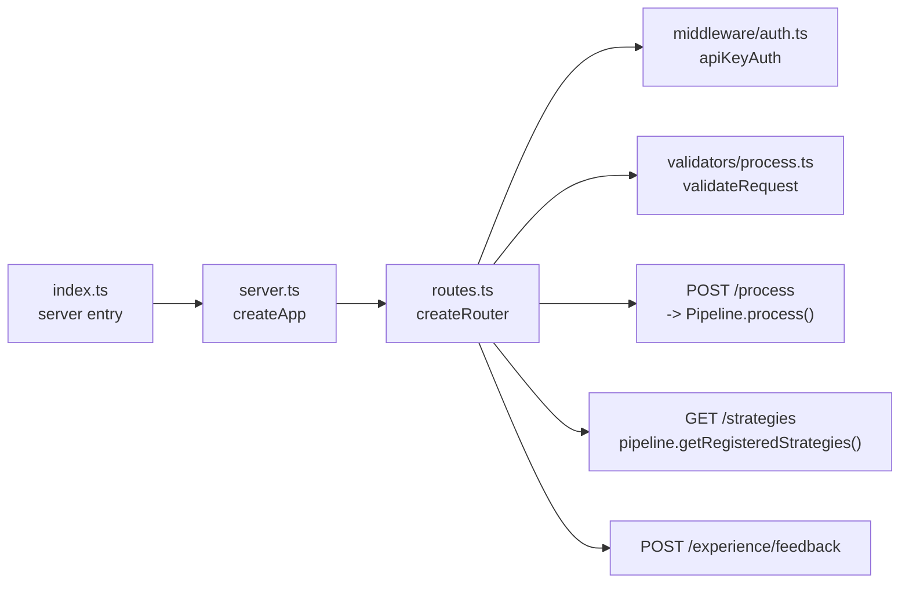

# Module: src/api — REST API Layer

## Module Overview

Exposes the Prae pipeline via Express.js REST API. Handles HTTP request parsing, base64 content decoding, API key authentication, Zod-based validation, and routing to the Pipeline orchestrator.

## Public API

### Entry Point

```typescript
// src/api/index.ts
import { startServer } from './server';
const PORT = parseInt(process.env.PORT ?? '3000');
startServer(PORT).catch(err => { console.error('Failed to start server:', err); process.exit(1); });
```

### App Factory & Server

```typescript
// src/api/server.ts
export function createApp(): Express
export function startServer(port: number): Promise<Express>
```

### Router Factory

```typescript
// src/api/routes.ts
export interface ApiConfig {
  pipeline?: Pipeline;
}
export function createRouter(config?: ApiConfig): Router
```

### Authentication Middleware

```typescript
// src/api/middleware/auth.ts
export interface ApiKeyAuthOptions {
  headerName?: string;  // default: 'X-API-Key'
  apiKey?: string;      // default: process.env.API_KEY || 'dev-api-key'
}
export function apiKeyAuth(options?: ApiKeyAuthOptions): (req: Request, res: Response, next: NextFunction) => void
```

### Request Validators

```typescript
// src/api/validators/process.ts
export const processRequestSchema: z.ZodSchema   // { content: string, contentType?: string }
export const feedbackRequestSchema: z.ZodSchema  // { contentItemId: string, rating: 1-5, feedback?: string }
export type ProcessRequest = z.infer<typeof processRequestSchema>
export type FeedbackRequest = z.infer<typeof feedbackRequestSchema>
export function validateRequest(schema: z.ZodSchema): (req: Request, res: Response, next: NextFunction) => void
```

## API Endpoints

| Method | Path | Auth | Description |
|--------|------|------|-------------|
| `GET` | `/health` | None | Returns `{ status: 'ok', timestamp }` |
| `POST` | `/api/v1/process` | X-API-Key | Process base64-encoded content |
| `GET` | `/api/v1/strategies` | X-API-Key | List registered strategies |
| `POST` | `/api/v1/experience/feedback` | X-API-Key | Record feedback |

### POST /api/v1/process

**Request:**
```json
{ "content": "<base64>", "contentType": "text/html" }
```

**Response:**
```json
{
  "success": true,
  "result": {
    "id": "item-1234567890",
    "outcome": "SUCCESS",
    "confidence": { "overall": 0.92, ... },
    "processingTimeMs": 145,
    "fusedOutput": { ... },
    "strategiesUsed": [ ... ]
  }
}
```

## Key Types

```typescript
// src/api/routes.ts
export interface ApiConfig {
  pipeline?: Pipeline;
}

// src/api/middleware/auth.ts
export interface ApiKeyAuthOptions {
  headerName?: string;
  apiKey?: string;
}

// src/api/validators/process.ts
type ProcessRequest = { content: string; contentType?: string }
type FeedbackRequest = { contentItemId: string; rating: number; feedback?: string }
```

## Dependencies

| Dependency | Purpose | Source |
|-----------|---------|--------|
| `express` | HTTP server framework | package.json |
| `zod` | Request validation schemas | package.json |
| `@types/express` | TypeScript types | package.json |
| `Pipeline` | Core orchestrator | `../core/Pipeline` |
| `Strategy` | Strategy interface | `../strategies/base/Strategy` |
| `StrategyRegistry` | Strategy registry | `../strategies/base/StrategyRegistry` |
| `InputRegistry` | Input source registry | `../input/InputRegistry` |
| `HTMLInputSource` | HTML parser | `../input/HTMLInputSource` |
| `HTMLCleanStrategy` | Denoise strategy | `../strategies/denoise/HTMLCleanStrategy` |
| `NavigationFilterStrategy` | Denoise strategy | `../strategies/denoise/NavigationFilterStrategy` |
| `ChunkingStrategy` | Semantic strategy | `../strategies/semantic/ChunkingStrategy` |
| `RelevanceFilterStrategy` | Semantic strategy | `../strategies/semantic/RelevanceFilterStrategy` |
| `JSONSchemaStrategy` | Output strategy | `../strategies/output/JSONSchemaStrategy` |
| `MarkdownStrategy` | Output strategy | `../strategies/output/MarkdownStrategy` |

## File Structure

```
src/api/
├── index.ts              # Server entry point
├── server.ts             # createApp(), startServer()
├── routes.ts             # createRouter(), route handlers, createDefaultPipeline()
├── middleware/
│   └── auth.ts           # apiKeyAuth() middleware factory
└── validators/
    └── process.ts        # Zod schemas, validateRequest()
```

## Mermaid Diagram — API Structure



## Important Implementation Details

### Default Pipeline Setup

`createDefaultPipeline()` registers strategies in this order:

| Phase | Strategy | Priority |
|-------|----------|----------|
| DENOISE | `HTMLCleanStrategy` | 100 |
| DENOISE | `NavigationFilterStrategy` | 90 |
| SEMANTIC | `ChunkingStrategy` | 100 |
| SEMANTIC | `RelevanceFilterStrategy` | 90 |
| OUTPUT | `JSONSchemaStrategy` | 50 |
| OUTPUT | `MarkdownStrategy` | 50 |

### Processing Flow

1. Receive `{ content: base64String, contentType?: string }`
2. Decode base64 to `Uint8Array`
3. `InputRegistry.detectMimeType()` identifies content type
4. Construct `ContentItem` and call `Pipeline.process()`
5. Return `{ success, result: { id, outcome, confidence, processingTimeMs, fusedOutput, strategiesUsed } }`

### Authentication Flow

1. All `/api/v1/*` routes require `X-API-Key` header
2. Key validated against `process.env.API_KEY` or fallback `'dev-api-key'`
3. Missing header returns `401 Unauthorized`
4. Invalid key returns `403 Forbidden`

### Known Issues

- `feedbackRequestSchema` is imported in `routes.ts:14` but **not currently exported** from `validators/process.ts` — the `/experience/feedback` route may have issues
- API key defaults to hardcoded `'dev-api-key'` — no `.env` validation at startup
- No rate limiting on endpoints
- Request body size limit: 10mb (Express default)

## Testing

| Test File | Scope |
|-----------|-------|
| `tests/unit/api/routes.test.ts` | All endpoints, auth middleware, validation |
| `tests/e2e/processing.spec.ts` | Full HTTP round-trip with Playwright |

## Related Files

| Path | Purpose |
|------|---------|
| `../core/Pipeline.ts` | Pipeline orchestrator |
| `../input/InputRegistry.ts` | MIME detection |
| `../strategies/base/Strategy.ts` | Strategy interface |
| `../../CLAUDE.md` | Root documentation |

## Changelog

- **2026-04-23 16:11:05** — Updated module documentation with complete API signatures, endpoint tables, and dependency matrix
- **2026-04-23** — Updated to new format with Mermaid diagram, complete API signatures, dependency table