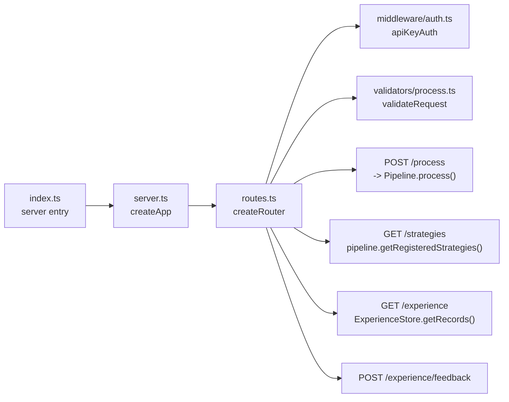

# Module: src/api — REST API Layer

## Module Overview

Exposes the Prae pipeline via Express.js REST API. Handles HTTP request parsing, base64 content decoding, API key authentication, Zod-based validation, and routing to the Pipeline orchestrator.

## Public API

### Entry Point

```typescript
// src/api/index.ts
import { startServer } from './server';
const PORT = parseInt(process.env.PORT ?? '3000');
startServer(PORT).catch(err => { console.error('Failed to start server:', err); process.exit(1); });
```

### App Factory & Server

```typescript
// src/api/server.ts
export function createApp(): Express
export interface StartedServer { app: Express; server: Server; close(): Promise<void> }
export function startServer(port: number): Promise<StartedServer>
```

### Router Factory

```typescript
// src/api/routes.ts
export interface ApiConfig {
  pipeline?: Pipeline;
  inputRegistry?: InputRegistry;
  experienceStore?: ExperienceStore;
}
export function createRouter(config?: ApiConfig): Router
```

### Authentication Middleware

```typescript
// src/api/middleware/auth.ts
export interface ApiKeyAuthOptions {
  headerName?: string;  // default: 'X-API-Key'
  apiKey?: string;      // default: process.env.API_KEY || 'dev-api-key'
}
export function apiKeyAuth(options?: ApiKeyAuthOptions): (req: Request, res: Response, next: NextFunction) => void
```

### Request Validators

```typescript
// src/api/validators/process.ts
export const processRequestSchema: z.ZodSchema   // { content: string, contentType?: string }
export const feedbackRequestSchema: z.ZodSchema  // { contentItemId: string, rating: 1-5, feedback?: string }
export const experienceQuerySchema: z.ZodSchema  // { filter?: recent|learnable, limit?: 1-100, tenantId?, sourceType?, outcome? }
export type ProcessRequest = z.infer<typeof processRequestSchema>
export type FeedbackRequest = z.infer<typeof feedbackRequestSchema>
export type ExperienceQuery = z.infer<typeof experienceQuerySchema>
export function validateRequest(schema: z.ZodSchema): (req: Request, res: Response, next: NextFunction) => void
```

## API Endpoints

| Method | Path | Auth | Description |
|--------|------|------|-------------|
| `GET` | `/health` | None | Returns `{ status: 'ok', timestamp }` |
| `POST` | `/api/v1/process` | X-API-Key | Process base64-encoded content |
| `GET` | `/api/v1/strategies` | X-API-Key | List registered strategies |
| `GET` | `/api/v1/experience` | X-API-Key | Read recent or learnable experience records |
| `POST` | `/api/v1/experience/feedback` | X-API-Key | Record feedback |

### POST /api/v1/process

**Request:**
```json
{ "content": "<base64>", "contentType": "text/html" }
```

**Response:**
```json
{
  "success": true,
  "result": {
    "id": "item-1234567890",
    "contentItemId": "item-1234567890",
    "outcome": "SUCCESS",
    "confidence": { "overall": 0.92, ... },
    "processingTimeMs": 145,
    "fusedOutput": { ... },
    "strategiesUsed": [ ... ]
  }
}
```

### GET /api/v1/experience

Reads local experience records from the configured `ExperienceStore`.

**Query parameters:**

| Parameter | Values | Default | Description |
|-----------|--------|---------|-------------|
| `filter` | `recent`, `learnable` | `recent` | `recent` returns newest records; `learnable` returns records with feedback that have not been learned |
| `limit` | integer `1..100` | `20` | Maximum records returned |
| `tenantId` | string | `default` in store layer | Tenant scope |
| `sourceType` | string | none | Filter by recorded input source type |
| `outcome` | `SUCCESS`, `RETRY_SUCCESS`, `CLOUD_ESCALATED`, `HUMAN_INTERVENTION`, `FAILED` | none | Filter by processing outcome |

**Example:**

```http
GET /api/v1/experience?filter=learnable&limit=10
X-API-Key: dev-api-key
```

**Response:**

```json
{
  "success": true,
  "filter": {
    "mode": "learnable",
    "limit": 10
  },
  "count": 1,
  "records": [
    {
      "id": "default:HTMLInputSource:...",
      "contentItemId": "...",
      "input": { "sourceType": "HTMLInputSource", "contentType": "text/html" },
      "processing": { "finalConfidence": 0.92 },
      "outcome": "SUCCESS",
      "humanFeedback": { "feedback": "Good result" },
      "learning": { "isLearned": false },
      "createdAt": 1710000000000,
      "updatedAt": 1710000000000
    }
  ]
}
```

## Key Types

```typescript
// src/api/routes.ts
export interface ApiConfig {
  pipeline?: Pipeline;
  inputRegistry?: InputRegistry;
  experienceStore?: ExperienceStore;
}

// src/api/middleware/auth.ts
export interface ApiKeyAuthOptions {
  headerName?: string;
  apiKey?: string;
}

// src/api/validators/process.ts
type ProcessRequest = { content: string; contentType?: string }
type FeedbackRequest = { contentItemId: string; rating: number; feedback?: string }
type ExperienceQuery = {
  filter: 'recent' | 'learnable';
  limit: number;
  tenantId?: string;
  sourceType?: string;
  outcome?: ProcessingResult['outcome'];
}
```

## Dependencies

| Dependency | Purpose | Source |
|-----------|---------|--------|
| `express` | HTTP server framework | package.json |
| `zod` | Request validation schemas | package.json |
| `@types/express` | TypeScript types | package.json |
| `Pipeline` | Core orchestrator | `../core/Pipeline` |
| `Strategy` | Strategy interface | `../strategies/base/Strategy` |
| `StrategyRegistry` | Strategy registry | `../strategies/base/StrategyRegistry` |
| `InputRegistry` | Input source registry | `../input/InputRegistry` |
| `HTMLInputSource` | HTML parser | `../input/HTMLInputSource` |
| `HTMLCleanStrategy` | Denoise strategy | `../strategies/denoise/HTMLCleanStrategy` |
| `NavigationFilterStrategy` | Denoise strategy | `../strategies/denoise/NavigationFilterStrategy` |
| `ChunkingStrategy` | Semantic strategy | `../strategies/semantic/ChunkingStrategy` |
| `RelevanceFilterStrategy` | Semantic strategy | `../strategies/semantic/RelevanceFilterStrategy` |
| `JSONSchemaStrategy` | Output strategy | `../strategies/output/JSONSchemaStrategy` |
| `MarkdownStrategy` | Output strategy | `../strategies/output/MarkdownStrategy` |
| `ExperienceStore` / `LocalExperienceStore` | Experience record reads, feedback storage, and default persistence | `../experience/ExperienceStore` |

## File Structure

```
src/api/
├── index.ts              # Server entry point
├── server.ts             # createApp(), startServer()
├── routes.ts             # createRouter(), route handlers, createDefaultPipeline()
├── middleware/
│   └── auth.ts           # apiKeyAuth() middleware factory
└── validators/
    └── process.ts        # Zod schemas, validateRequest()
```

## Mermaid Diagram — API Structure



## Important Implementation Details

### Default Pipeline Setup

`createDefaultPipeline()` registers strategies in this order:

| Phase | Strategy | Priority |
|-------|----------|----------|
| DENOISE | `HTMLCleanStrategy` | 100 |
| DENOISE | `NavigationFilterStrategy` | 90 |
| SEMANTIC | `ChunkingStrategy` | 100 |
| SEMANTIC | `RelevanceFilterStrategy` | 90 |
| OUTPUT | `JSONSchemaStrategy` | 50 |
| OUTPUT | `MarkdownStrategy` | 50 |

### Processing Flow

1. Receive `{ content: base64String, contentType?: string }`
2. Decode base64 to `Uint8Array`
3. `InputRegistry.detectMimeType()` identifies content type
4. Construct `ContentItem` via a registered input source when available
5. Call `Pipeline.process()`, which records processing output through the configured `ExperienceStore`
6. Return `{ success, result: { id, contentItemId, outcome, confidence, processingTimeMs, fusedOutput, strategiesUsed } }`

### Feedback Persistence Flow

1. `/api/v1/process` returns `result.contentItemId`
2. `Pipeline` records the processing result through `ExperienceStore.recordProcessing()`
3. `/api/v1/experience/feedback` accepts that `contentItemId` and calls boolean-returning `ExperienceStore.addHumanFeedback()`
4. Feedback targets the newest terminal attempt for that content item; `false` produces HTTP 404
5. The default router store persists records to `data/experience-store.json` outside test mode
6. `PRAE_EXPERIENCE_STORE_PATH` can override the persistence file path

### Server Lifecycle

`startServer()` resolves only after listening and returns `{ app, server, close }`. `close()` is asynchronous and idempotent, allowing tests and callers to await server shutdown safely.

### Experience Read Flow

1. `/api/v1/experience` validates query parameters with `experienceQuerySchema`
2. The route calls `ExperienceStore.getRecords()` on the same store used by processing and feedback
3. `filter=recent` returns newest records first; `filter=learnable` returns feedback records that are not learned
4. API responses omit `tenantId` while keeping record id, content item id, input, processing, outcome, feedback, learning, and timestamps

### Authentication Flow

1. All `/api/v1/*` routes require `X-API-Key` header
2. Key validated against `process.env.API_KEY` or fallback `'dev-api-key'`
3. Missing header returns `401 Unauthorized`
4. Invalid key returns `403 Forbidden`

### Known Issues

- API key defaults to hardcoded `'dev-api-key'` — no `.env` validation at startup
- No rate limiting on endpoints
- Request body size limit: 10mb (Express default)

## Testing

| Test File | Scope |
|-----------|-------|
| `tests/unit/api/routes.test.ts` | All endpoints, auth middleware, validation, experience reads, feedback persistence |
| `tests/e2e/processing.spec.ts` | Full HTTP round-trip with Playwright |

## Related Files

| Path | Purpose |
|------|---------|
| `../core/Pipeline.ts` | Pipeline orchestrator |
| `../input/InputRegistry.ts` | MIME detection |
| `../strategies/base/Strategy.ts` | Strategy interface |
| `../../CLAUDE.md` | Root documentation |

## Changelog

- **2026-07-14** - Documented `StartedServer.close()` and boolean feedback/404 behavior
- **2026-06-05** - Documented `GET /api/v1/experience` read endpoint and query filters
- **2026-06-05** - Aligned API docs with persisted feedback flow and current `ApiConfig`

- **2026-04-23 16:11:05** — Updated module documentation with complete API signatures, endpoint tables, and dependency matrix
- **2026-04-23** — Updated to new format with Mermaid diagram, complete API signatures, dependency table
