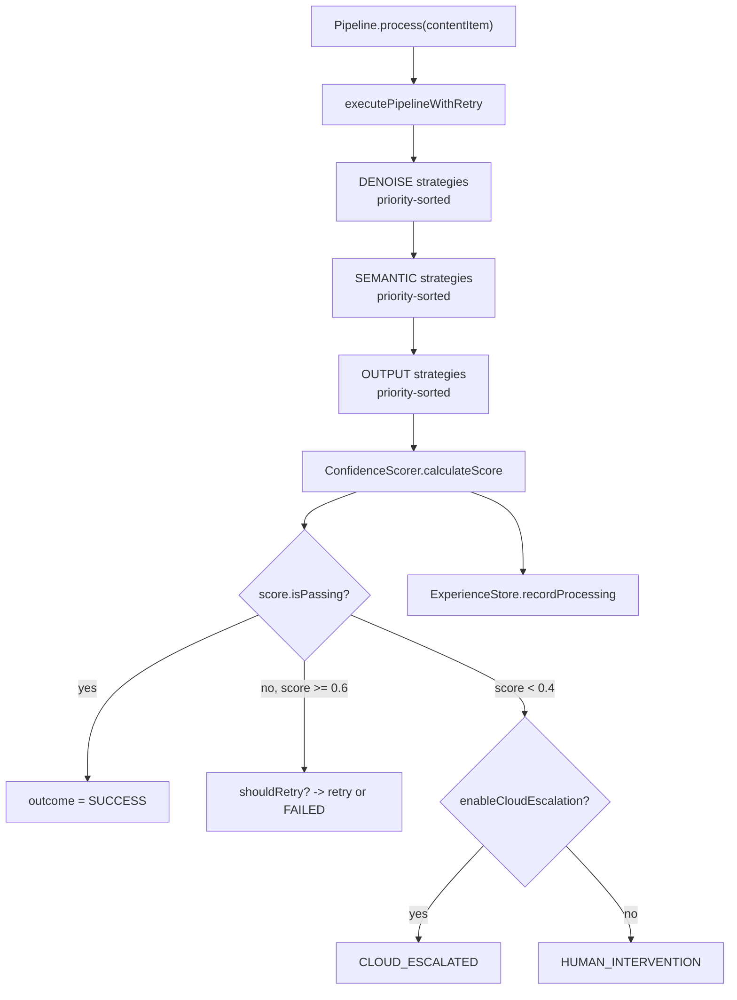
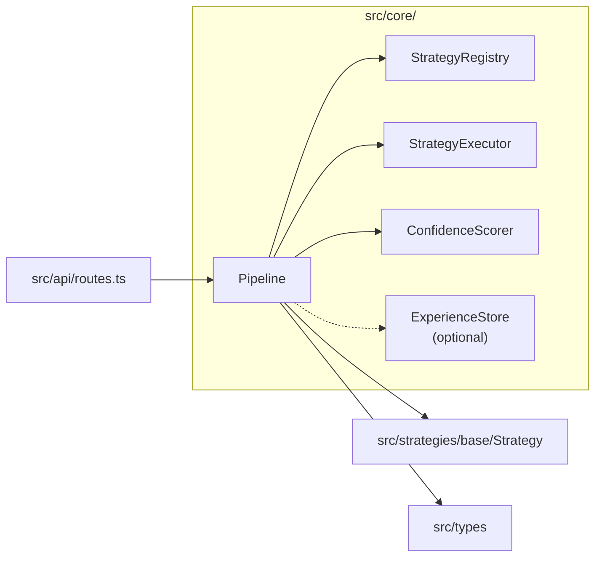

# Module: src/core — Pipeline Orchestrator & Confidence Scoring

## Module Overview

Core processing engine of Prae. `Pipeline` orchestrates the multi-strategy pipeline (DENOISE -> SEMANTIC -> OUTPUT) with retry logic and outcome determination. `ConfidenceScorer` evaluates processing quality via weighted component analysis.

## Public API

### Pipeline

```typescript
// src/core/Pipeline.ts
export interface PipelineConfig {
  maxRetries?: number;              // default: 3
  enableCloudEscalation?: boolean;  // default: false
}

export class Pipeline {
  constructor(config?: PipelineConfig)
  setExperienceStore(store: ExperienceStore): void
  getRegisteredStrategies(): Strategy[]
  registerStrategy(strategy: Strategy): void
  async process(contentItem: ContentItem): Promise<ProcessingResult>
  mergeOutput(contentItem: ContentItem, fusedOutput: unknown): void
}

// ExperienceStore interface (expected by Pipeline)
export interface ExperienceStore {
  getHistoricalContext(contentItemId: string): Promise<unknown>
  recordProcessing(contentItemId: string, result: ProcessingResult): Promise<void>
}
```

### ConfidenceScorer

```typescript
// src/core/ConfidenceScorer.ts
export class ConfidenceScorer {
  constructor(config?: Partial<ConfidenceConfig>)
  calculateScore(
    contentItem: ContentItem,
    executions: StrategyExecution[],
    metadata?: { historicalScore?: number; successfulStrategyIds?: string[] }
  ): ConfidenceScore
  shouldRetry(score: ConfidenceScore): boolean
  shouldEscalate(score: ConfidenceScore): boolean
}
```

## Key Types

### ConfidenceScore

```typescript
interface ConfidenceScore {
  overall: number;           // 0-1 weighted composite
  components: {
    textQuality: number;        // text length, word density, formatting
    entityExtraction: number;   // entities/mentions/namedEntities count
    structuralIntegrity: number; // structure/format/schema presence
    contextualCoherence: number; // coherence metadata + successful executions
  };
  bonus: {
    historicalConsistency: number;    // up to 0.1
    multiStrategyAgreement: number;   // up to 0.075
  };
  isPassing: boolean;   // overall >= 0.85
}
```

### ProcessingResult Outcome

```typescript
type ProcessingResult['outcome'] =
  | 'SUCCESS'           // first try success
  | 'RETRY_SUCCESS'     // success after retry
  | 'CLOUD_ESCALATED'   // low confidence, escalated to cloud
  | 'HUMAN_INTERVENTION' // low confidence, requires human review
  | 'FAILED'            // max retries exceeded or fatal error
```

## Dependencies

| Dependency | Purpose | Source |
|-----------|---------|--------|
| `../types` | `ContentItem`, `ProcessingResult`, `StrategyExecution`, `ConfidenceScore` | `src/types/index.ts` |
| `../strategies/base/Strategy` | `Strategy`, `StrategyType` | `src/strategies/base/Strategy.ts` |
| `../strategies/base/StrategyRegistry` | Strategy registry | `src/strategies/base/StrategyRegistry.ts` |
| `../strategies/base/StrategyExecutor` | Execution engine | `src/strategies/base/StrategyExecutor.ts` |
| `../experience/ExperienceStore` | Experience store (optional) | `src/experience/ExperienceStore.ts` |

## File Structure

```
src/core/
├── Pipeline.ts         # Pipeline orchestrator (main entry)
└── ConfidenceScorer.ts # Confidence scoring calculator
```

## Mermaid Diagram — Pipeline Flow



## Mermaid Diagram — Module Relationships



## Important Implementation Details

### Strategy Execution Order

Strategies execute in strict type order, sorted by priority ascending (lower number = higher priority within group):

1. **DENOISE** strategies — `HTMLCleanStrategy` (100), `NavigationFilterStrategy` (90)
2. **SEMANTIC** strategies — `ChunkingStrategy` (100), `RelevanceFilterStrategy` (90)
3. **OUTPUT** strategies — `JSONSchemaStrategy` (50), `MarkdownStrategy` (50)

### Output Merging (mergeOutput)

After each phase, fused output is merged back into `contentItem.meta`:

| Output Type | Meta Keys Set |
|-------------|---------------|
| `string` | `cleanedText`, `textContent` |
| `{ cleanedText }` | `cleanedText`, `textContent` |
| `{ filteredText }` | `filteredText`, `textContent` |
| `{ entities }` | `entities` |
| `{ structure }` | `structure` |

### Retry Logic

```
for retryCount in 0..maxRetries:
    execute all strategy phases
    if SUCCESS or RETRY_SUCCESS: return result
    if CLOUD_ESCALATED or HUMAN_INTERVENTION: return result
    if FAILED and shouldRetry(score) and retryCount < max: continue
    else: return result
```

### Confidence Score Components

| Component | Weight | Indicators |
|-----------|--------|------------|
| `textQuality` | 0.30 | `cleanedText`, `textContent`, `length` |
| `entityExtraction` | 0.25 | `entities`, `mentions`, `namedEntities` |
| `structuralIntegrity` | 0.25 | `structure`, `format`, `schema` |
| `contextualCoherence` | 0.20 | `coherence`, `context`, `relevance` |

**Bonuses:**
- `historicalConsistency`: up to `historicalWeight` (0.1) based on historical score
- `multiStrategyAgreement`: up to `consistencyBonus * 1.5` (0.075) when multiple strategies agree

### Default Thresholds

| Threshold | Value | Condition |
|-----------|-------|-----------|
| `pass` | 0.85 | Accept result |
| `retry` | 0.60 | Retry if retries < max |
| `escalate` | 0.40 | Escalate (cloud or human) |

### Experience Store Integration

`Pipeline.setExperienceStore()` accepts an `ExperienceStore` interface (defined in Pipeline.ts as a stub). The `recordProcessing` call is fire-and-forget — errors are silently swallowed.

### Module Augmentation

The API layer extends `Pipeline` interface via declaration merging to add `getRegisteredStrategies()`.

## Testing

| Test File | Coverage |
|-----------|----------|
| `tests/unit/core/Pipeline.test.ts` | Orchestration, retry logic, outcome determination |
| `tests/unit/core/ConfidenceScorer.test.ts` | Score calculation, threshold checks, bonus computation |

## Related Files

| Path | Purpose |
|------|---------|
| `../strategies/base/StrategyExecutor.ts` | Executes registered strategies |
| `../strategies/base/StrategyRegistry.ts` | Strategy management |
| `../experience/ExperienceStore.ts` | Experience store (interface stub in Pipeline.ts) |
| `../../CLAUDE.md` | Root documentation |

## Changelog

- **2026-04-23 16:11:05** — Updated module documentation with complete API signatures, pipeline flow diagrams, and retry logic explanation
- **2026-04-23** — Updated to new format with Mermaid diagram, complete API signatures, dependency table