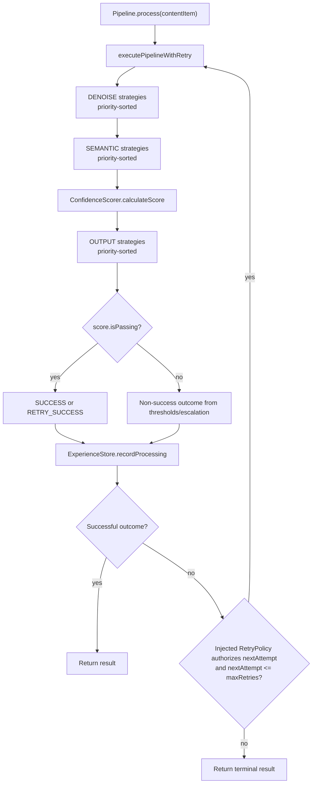
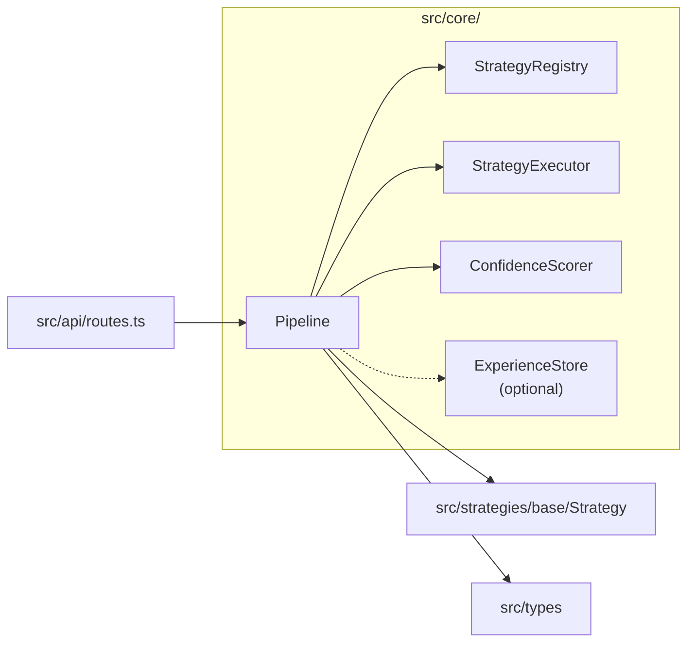

# Module: src/core — Pipeline Orchestrator & Confidence Scoring

## Module Overview

Core processing engine of Prae. `Pipeline` runs DENOISE and SEMANTIC transforms sequentially, scores their canonical state, then runs OUTPUT renderers. `ConfidenceScorer` evaluates processing quality via weighted component analysis.

## Public API

### Pipeline

```typescript
// src/core/Pipeline.ts
export interface PipelineConfig {
  maxRetries?: number;              // default: 3
  enableCloudEscalation?: boolean;  // default: false
  retryPolicy?: RetryPolicy;        // omitted by default; retries are opt-in
  onDiagnostic?: (event: PipelineDiagnostic) => void;
}

export class Pipeline {
  constructor(config?: PipelineConfig)
  setExperienceStore(store: ExperienceStore): void
  getRegisteredStrategies(): Strategy[]
  registerStrategy(strategy: Strategy): void
  async process(contentItem: ContentItem): Promise<ProcessingResult>
  mergeOutput(contentItem: ContentItem, fusedOutput: unknown): void
}

// ExperienceStore interface (imported from src/experience/ExperienceStore.ts)
export interface ExperienceStore {
  getHistoricalContext(contentItemId: string): Promise<unknown>
  recordProcessing(contentItemId: string, result: ProcessingResult): Promise<void>
}
```

### ConfidenceScorer

```typescript
// src/core/ConfidenceScorer.ts
export class ConfidenceScorer {
  constructor(config?: Partial<ConfidenceConfig>)
  calculateScore(
    contentItem: ContentItem,
    executions: StrategyExecution[],
    metadata?: { historicalScore?: number; successfulStrategyIds?: string[] }
  ): ConfidenceScore
  shouldRetry(score: ConfidenceScore): boolean
  shouldEscalate(score: ConfidenceScore): boolean
}
```

## Key Types

### ConfidenceScore

```typescript
interface ConfidenceScore {
  overall: number;           // 0-1 weighted composite
  components: {
    textQuality: number;        // text length, word density, formatting
    entityExtraction: number;   // entities/mentions/namedEntities count
    structuralIntegrity: number; // structure/format/schema presence
    contextualCoherence: number; // coherence metadata + successful executions
  };
  bonus: {
    historicalConsistency: number;    // up to 0.1
    multiStrategyAgreement: number;   // up to 0.075
  };
  isPassing: boolean;   // overall >= 0.85
}
```

### ProcessingResult Outcome

```typescript
type ProcessingResult['outcome'] =
  | 'SUCCESS'           // first try success
  | 'RETRY_SUCCESS'     // success after retry
  | 'CLOUD_ESCALATED'   // low confidence, escalated to cloud
  | 'HUMAN_INTERVENTION' // low confidence, requires human review
  | 'FAILED'            // max retries exceeded or fatal error
```

## Dependencies

| Dependency | Purpose | Source |
|-----------|---------|--------|
| `../types` | `ContentItem`, `ProcessingResult`, `StrategyExecution`, `ConfidenceScore` | `src/types/index.ts` |
| `../strategies/base/Strategy` | `Strategy`, `StrategyType` | `src/strategies/base/Strategy.ts` |
| `../strategies/base/StrategyRegistry` | Strategy registry | `src/strategies/base/StrategyRegistry.ts` |
| `../strategies/base/StrategyExecutor` | Execution engine | `src/strategies/base/StrategyExecutor.ts` |
| `../experience/ExperienceStore` | Experience store (optional) | `src/experience/ExperienceStore.ts` |

## File Structure

```
src/core/
├── Pipeline.ts         # Pipeline orchestrator (main entry)
└── ConfidenceScorer.ts # Confidence scoring calculator
```

## Mermaid Diagram — Pipeline Flow



## Mermaid Diagram — Module Relationships



## Important Implementation Details

### Strategy Execution Order

Transforms execute one at a time in strict type order, with each successful output becoming the next strategy's input. Strategies are sorted by priority ascending (lower number = higher priority within group):

1. **DENOISE** strategies — `HTMLCleanStrategy` (100), `NavigationFilterStrategy` (90)
2. **SEMANTIC** strategies — `ChunkingStrategy` (100), `RelevanceFilterStrategy` (90)
3. Compute confidence from the canonical transformed state
4. **OUTPUT** strategies — `JSONSchemaStrategy` (50), `MarkdownStrategy` (50)

### Output Merging (mergeOutput)

Known transform output is merged into typed `PipelineState` and projected into the next `ContentItem`; output renderers do not feed another transform stage:

Canonical text fields are normalized at this boundary. Nullish precedence remains `filteredText ?? cleanedText ?? textContent ?? ''`; a selected non-string value is converted with `String(value)`, while an explicitly empty string stays authoritative. `ConfidenceScorer` and output renderers use the same neutral canonical-text utility.

| Output Type | Meta Keys Set |
|-------------|---------------|
| `string` | `cleanedText`, `textContent` |
| `{ cleanedText }` | `cleanedText`, `textContent` |
| `{ filteredText }` | `filteredText`, `textContent` |
| `{ entities }` | `entities` |
| `{ structure }` | `structure` |

### Retry Logic

```
execute first attempt
if SUCCESS or RETRY_SUCCESS: return result
if no RetryPolicy: return terminal result
while RetryPolicy.canRetry(result, nextAttempt) and nextAttempt <= maxRetries:
    attempt = RetryPolicy.prepareAttempt(freshCloneOfOriginal, nextAttempt)
    execute attempt
return terminal result
```

### Confidence Score Components

| Component | Weight | Indicators |
|-----------|--------|------------|
| `textQuality` | 0.30 | `cleanedText`, `textContent`, `length` |
| `entityExtraction` | 0.25 | `entities`, `mentions`, `namedEntities` |
| `structuralIntegrity` | 0.25 | `structure`, `format`, `schema` |
| `contextualCoherence` | 0.20 | `coherence`, `context`, `relevance` |

**Bonuses:**
- `historicalConsistency`: up to `historicalWeight` (0.1) based on historical score
- `multiStrategyAgreement`: up to `consistencyBonus * 1.5` (0.075) when multiple strategies agree

### Default Thresholds

| Threshold | Value | Condition |
|-----------|-------|-----------|
| `pass` | 0.85 | Accept result |
| `retry` | 0.60 | Produces a retryable `FAILED` result; retry still requires `RetryPolicy` |
| `escalate` | 0.40 | Escalate (cloud or human) |

### Experience Store Integration

`Pipeline.setExperienceStore()` accepts the shared `ExperienceStore` interface from `src/experience/ExperienceStore.ts`. During processing, Pipeline asks the store for historical confidence context by `contentItem.id`, then records each completed attempt through `recordProcessing()`. Store errors are caught; optional diagnostic callbacks are observational, and callback failures are also contained so content processing is not changed.

### Module Augmentation

The API layer extends `Pipeline` interface via declaration merging to add `getRegisteredStrategies()`.

## Testing

| Test File | Coverage |
|-----------|----------|
| `tests/unit/core/Pipeline.test.ts` | Orchestration, retry logic, outcome determination |
| `tests/unit/core/ConfidenceScorer.test.ts` | Score calculation, threshold checks, bonus computation |

## Related Files

| Path | Purpose |
|------|---------|
| `../strategies/base/StrategyExecutor.ts` | Executes registered strategies |
| `../strategies/base/StrategyRegistry.ts` | Strategy management |
| `../experience/ExperienceStore.ts` | Shared ExperienceStore interface and LocalExperienceStore implementation |
| `../../CLAUDE.md` | Root documentation |

## Changelog

- **2026-07-14** - Documented sequential transforms, confidence-before-rendering, opt-in retries, and contained diagnostics
- **2026-06-05** - Updated ExperienceStore integration notes to match the shared store interface

- **2026-04-23 16:11:05** — Updated module documentation with complete API signatures, pipeline flow diagrams, and retry logic explanation
- **2026-04-23** — Updated to new format with Mermaid diagram, complete API signatures, dependency table
