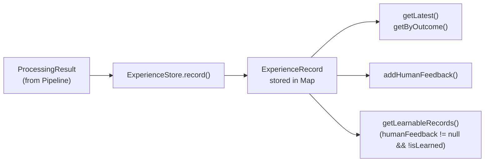

# Module: src/experience — Experience Store & Learning

## Module Overview

Local store for recording processing outcomes and learning. `LocalExperienceStore` keeps records in a `Map` keyed by `tenantId:sourceType`, and can optionally persist that map to a JSON file. Records `ProcessingResult` with input fingerprints, strategy sequences, outcomes, and optional human feedback.

**Note:** `LocalExperienceStore` includes Pipeline-compatible adapter methods (`getHistoricalContext`, `recordProcessing`) in addition to the full experience-store API.

## Public API

### ExperienceStore Interface

```typescript
// src/experience/ExperienceStore.ts
export interface ExperienceStore {
  record(result: ProcessingResult, tenantId?: string): Promise<void>;
  getLatest(sourceType: string, tenantId?: string): Promise<ExperienceRecord | null>;
  getByOutcome(outcome: ProcessingResult['outcome'], tenantId?: string): Promise<ExperienceRecord[]>;
  addHumanFeedback(recordId: string, feedback: string, correctedResult?: unknown, tenantId?: string): Promise<void>;
  getLearnableRecords(tenantId?: string): Promise<ExperienceRecord[]>;
  getHistoricalContext(contentItemId: string): Promise<unknown>;
  recordProcessing(contentItemId: string, result: ProcessingResult): Promise<void>;
}
```

### LocalExperienceStore Implementation

```typescript
// src/experience/ExperienceStore.ts
export class LocalExperienceStore implements ExperienceStore {
  constructor(options?: { filePath?: string })
  async record(result: ProcessingResult, tenantId?: string): Promise<void>
  async getLatest(sourceType: string, tenantId?: string): Promise<ExperienceRecord | null>
  async getByOutcome(outcome: ProcessingResult['outcome'], tenantId?: string): Promise<ExperienceRecord[]>
  async addHumanFeedback(recordId: string, feedback: string, correctedResult?: unknown, tenantId?: string): Promise<void>
  async getLearnableRecords(tenantId?: string): Promise<ExperienceRecord[]>
  async getHistoricalContext(contentItemId: string): Promise<unknown>
  async recordProcessing(contentItemId: string, result: ProcessingResult): Promise<void>
}
```

## Key Types

```typescript
// src/experience/ExperienceRecord.ts
export interface ExperienceRecord {
  id: string;                    // "${tenantId}:${sourceType}:${randomHex}"
  tenantId: string;
  contentItemId?: string;
  input: ExperienceRecordInput;
  processing: ExperienceRecordProcessing;
  outcome: ProcessingResult['outcome'];
  humanFeedback?: HumanFeedback;
  learning: Learning;
  createdAt: number;
  updatedAt: number;
}

export interface ExperienceRecordInput {
  sourceType: string;
  contentType: string;
  rawHash: string;      // SHA-256, first 16 hex chars
  size: number;
}

export interface ExperienceRecordProcessing {
  strategiesUsed: string[];
  fusionMethod: string;
  finalConfidence: number;
  processingTimeMs: number;
  retryCount: number;
}

export interface HumanFeedback {
  correctedResult?: unknown;
  feedback: string;
}

export interface Learning {
  isLearned: boolean;
  strategyUpdates?: Record<string, unknown>;
}
```

## Dependencies

| Dependency | Purpose | Source |
|-----------|---------|--------|
| `crypto` (Node.js built-in) | SHA-256 hashing via `createHash` | — |
| `fs/promises` (Node.js built-in) | Optional JSON persistence | — |
| `path` (Node.js built-in) | Persistence directory handling | — |
| `../types` | `ProcessingResult`, `ContentItem` | `src/types/index.ts` |
| `./ExperienceRecord` | `ExperienceRecord` type | `src/experience/ExperienceRecord.ts` |

## File Structure

```
src/experience/
├── ExperienceRecord.ts  # Type definitions for ExperienceRecord
└── ExperienceStore.ts   # ExperienceStore interface + LocalExperienceStore implementation
```

## Mermaid Diagram — Data Flow



## Important Implementation Details

### Storage

`LocalExperienceStore` uses an in-memory `Map<string, ExperienceRecord[]>` keyed by `${tenantId}:${sourceType}`. When constructed with `{ filePath }`, it lazily loads records from a versioned JSON file and writes changes back after `record()` and `addHumanFeedback()`.

The default API router constructs a file-backed store outside test mode. Its default path is `data/experience-store.json`, and `PRAE_EXPERIENCE_STORE_PATH` can override it. No-argument construction remains in-memory for tests and custom injected stores.

The persisted file format is versioned:

```typescript
interface PersistedExperienceStore {
  version: 1;
  records: Array<[string, ExperienceRecord[]]>;
}
```

Writes create the parent directory, write a temporary JSON file, then rename it into place. This keeps the MVP file store simple while avoiding partially written target files in normal operation.

### Content Fingerprinting

```typescript
function hashContent(content: Uint8Array): string {
  return createHash('sha256').update(content).digest().slice(0, 16).toString('hex');
}
```

### Record ID Format

`${tenantId}:${sourceType}:${randomBytes(8).toString('hex')}` — uniqueness not guaranteed across rapid inserts.

### getLatest() Implementation

Returns the most recently added record for a given `sourceType` (last element in the array):

```typescript
async getLatest(sourceType: string, tenantId: string = 'default'): Promise<ExperienceRecord | null> {
  const key = `${tenantId}:${sourceType}`;
  const records = this.records.get(key);
  if (!records || records.length === 0) return null;
  return records[records.length - 1];  // Most recent
}
```

### getLearnableRecords Logic

Returns records where `humanFeedback !== undefined && learning.isLearned === false`. These are records awaiting integration into strategy updates.

### addHumanFeedback() Behavior

Updates the matching record in-place, setting `humanFeedback` and `updatedAt`, then persists when `filePath` is configured. A match can be either the generated experience record `id` or the `contentItemId` returned by `/api/v1/process`:

```typescript
record.humanFeedback = { correctedResult, feedback };
record.updatedAt = Date.now();
```

## Testing

| Test File | Coverage |
|-----------|----------|
| `tests/unit/experience/ExperienceStore.test.ts` | Full LocalExperienceStore API and restart persistence |
| `tests/unit/api/routes.test.ts` | Feedback route writes through configured store and persists with default file-backed store |

## Related Files

| Path | Purpose |
|------|---------|
| `../core/Pipeline.ts` | Records processing results and reads historical confidence context |
| `../types/index.ts` | `ProcessingResult` type |
| `../../CLAUDE.md` | Root documentation |

## Changelog

- **2026-06-05** - Documented persisted file format and feedback lookup by `contentItemId`

- **2026-06-03** — Documented optional JSON persistence and API restart-survival behavior
- **2026-04-23 16:11:05** — Updated module documentation with complete API signatures, storage details, and interface incompatibility warning
- **2026-04-23** — Updated to new format with Mermaid diagram, complete API signatures, dependency table
