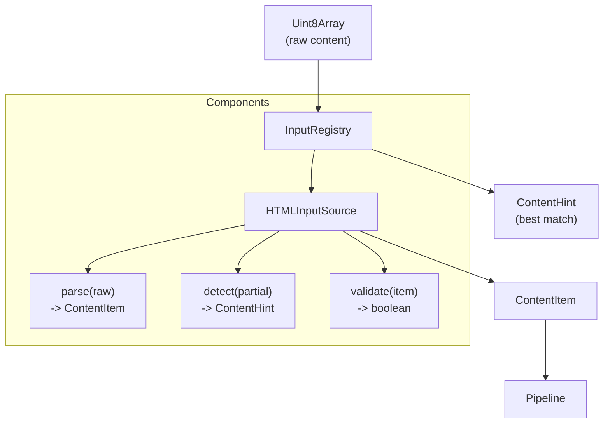

# Module: src/input — Input Source Plugin System

## Module Overview

Pluggable input source system for parsing and detecting content types. `InputSource` interface defines the contract for MIME detection and content parsing. `InputRegistry` manages multiple sources and selects the best match via confidence scoring.

## Public API

### InputSource Interface

```typescript
// src/input/InputSource.ts
export interface InputSource {
  name: string;
  version: string;
  supportedTypes: string[];
  parse(raw: Uint8Array): ContentItem;
  detect(partial: Uint8Array): ContentHint;
  validate(item: ContentItem): boolean;
}
```

### InputRegistry

```typescript
// src/input/InputRegistry.ts
export class InputRegistry {
  constructor()
  register(source: InputSource): void
  unregister(name: string): void
  get(name: string): InputSource | undefined
  list(): InputSource[]
  detectMimeType(partial: Uint8Array): ContentHint
}
```

### HTMLInputSource

```typescript
// src/input/HTMLInputSource.ts
export class HTMLInputSource implements InputSource {
  public name = 'HTMLInputSource';
  public version = '1.0.0';
  public supportedTypes = ['text/html', 'application/html'];

  parse(raw: Uint8Array): ContentItem
  detect(partial: Uint8Array): ContentHint
  validate(item: ContentItem): boolean
}
```

## Key Types

```typescript
// src/types/index.ts
export interface ContentHint {
  mimeType?: string;
  encoding?: string;
  estimatedSize?: number;
  possibleTypes?: string[];
  confidence?: number;
}

export interface ContentItem {
  id: string;
  source: string;
  raw: Uint8Array;
  meta: Record<string, unknown>;
  hints: ContentHint;
}
```

## Dependencies

| Dependency | Purpose | Source |
|-----------|---------|--------|
| `jsdom` | DOM parsing for HTML | package.json |
| `uuid` | ID generation for ContentItem | package.json |
| `../types` | `ContentItem`, `ContentHint` | `src/types/index.ts` |

## File Structure

```
src/input/
├── InputSource.ts      # Base interface
├── InputRegistry.ts   # Registry + MIME detection router
└── HTMLInputSource.ts  # HTML implementation
```

## Mermaid Diagram — Plugin Architecture



## Important Implementation Details

### HTMLInputSource Detection Logic

`detect()` reads only the first 1024 bytes:

| Pattern Found | Confidence |
|--------------|-----------|
| `<!doctype html>` (case-insensitive) | 0.95 |
| `<html>`, `<head>`, or `<body>` tag | 0.80 |
| `<!doctype>` (generic) | 0.70 |
| None of above | 0.30 |

### HTMLInputSource.parse() Output Meta

```typescript
{
  title: document.title,
  textContent: body.textContent?.trim() || '',
  document: originalHtmlString
}
```

### InputRegistry.detectMimeType()

Iterates all registered sources, calls `detect(partial)` on each, returns the hint with highest `confidence` score.

### Plugin Registration Pattern

To add a new input source (e.g., `PDFInputSource`):

1. Create a class implementing `InputSource`
2. Register it with `InputRegistry.register(new PDFInputSource())`

## Known Limitations

- Only `HTMLInputSource` is currently implemented
- No validation of overlapping mime types between sources
- `detectMimeType` only returns hints from the highest-confidence source; other candidates are discarded
- No support for source priority ordering

## Testing

| Test File | Coverage |
|-----------|----------|
| `tests/unit/input/HTMLInputSource.test.ts` | detect(), parse(), validate() |

## Related Files

| Path | Purpose |
|------|---------|
| `../types/index.ts` | `ContentItem`, `ContentHint` definitions |
| `../core/Pipeline.ts` | Uses InputRegistry in routes.ts |
| `../../CLAUDE.md` | Root documentation |

## Changelog

- **2026-04-23 16:11:05** — Updated module documentation with complete API signatures, detection confidence table, and plugin registration pattern
- **2026-04-23** — Updated to new format with Mermaid diagram, complete API signatures, dependency table