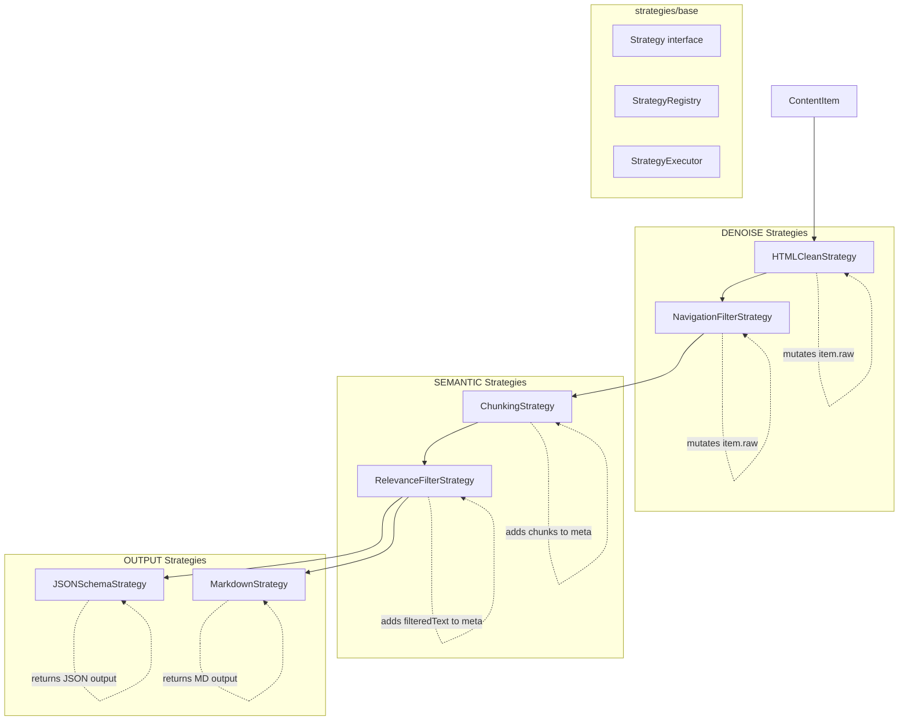

# Module: src/strategies — Strategy Plugin System

## Module Overview

Pluggable strategy system for content processing. All strategies implement the `Strategy` interface with three types: **DENOISE** (remove noise), **SEMANTIC** (extract/chunk/filter), **OUTPUT** (format output). `StrategyRegistry` manages registration and queries; `StrategyExecutor` handles execution and result fusion.

## Module Hierarchy

```
strategies/
├── base/
│   ├── Strategy.ts           # Interface & StrategyType enum
│   ├── StrategyRegistry.ts   # Registration & queries
│   └── StrategyExecutor.ts   # Execution engine + fusion
├── denoise/
│   ├── HTMLCleanStrategy.ts   # Remove scripts, styles, ads, nav, structural tags
│   └── NavigationFilterStrategy.ts  # Remove nav/header/footer/aside
├── semantic/
│   ├── ChunkingStrategy.ts    # Sentence-based chunking (512 char target)
│   └── RelevanceFilterStrategy.ts  # Paragraph dedup via Jaccard similarity
└── output/
    ├── CanonicalText.ts        # ContentItem adapter for shared canonical-text selection
    ├── JSONSchemaStrategy.ts   # Structured JSON output
    └── MarkdownStrategy.ts    # Markdown output with title heading
```

## Public API

### Strategy Interface

```typescript
// src/strategies/base/Strategy.ts
export enum StrategyType {
  DENOISE = 'DENOISE',
  SEMANTIC = 'SEMANTIC',
  OUTPUT = 'OUTPUT',
}

export interface StrategyConfig {
  enabled: boolean;
  priority: number;         // Lower = runs first within type group
  params: Record<string, unknown>;
}

export interface Strategy {
  id: string;
  name: string;
  type: StrategyType;
  version: string;
  config: StrategyConfig;
  canApply(item: ContentItem): boolean;
  execute(item: ContentItem): Promise<StrategyExecution>;
}
```

### StrategyRegistry

```typescript
// src/strategies/base/StrategyRegistry.ts
export class StrategyRegistry {
  register(strategy: Strategy): void           // Throws if duplicate id
  unregister(strategyId: string): boolean
  get(strategyId: string): Strategy | undefined
  getByType(type: StrategyType): Strategy[]
  listByPriority(type: StrategyType): Strategy[]  // Sorted by priority ascending
  getAll(): Strategy[]
  clear(): void
}
```

### StrategyExecutor

```typescript
// src/strategies/base/StrategyExecutor.ts
export interface ExecuteOptions {
  stopOnError?: boolean;
}

export interface ExecutionResult {
  strategyId: string;
  success: boolean;
  output?: unknown;
  error?: string;
}

export class StrategyExecutor {
  register(strategy: Strategy): void
  unregister(strategyId: string): boolean
  async executeStrategies(items: ContentItem[], options?: ExecuteOptions): Promise<ExecutionResult[]>
  fuseResults(results: ExecutionResult[]): unknown
}
```

## Key Types

```typescript
// src/strategies/semantic/ChunkingStrategy.ts
export interface Chunk {
  id: string;
  index: number;
  text: string;
  startChar: number;
  endChar: number;
  tokenEstimate: number;
}
export interface ChunkingResult {
  chunks: Chunk[];
  totalChunks: number;
}

// src/strategies/semantic/RelevanceFilterStrategy.ts
export interface RelevanceFilterResult {
  filteredText: string;
  removedRatio: number;
}

// src/strategies/output/JSONSchemaStrategy.ts
export interface JSONSchemaOutput {
  version: string;
  content: { text: string; title?: string; url?: string };
  metadata: { source: string; processedAt: string; confidence: number; strategiesApplied: string[] };
  chunks?: Array<{ id: string; index: number; text: string; tokenEstimate: number }>;
}

// src/strategies/output/MarkdownStrategy.ts
export interface MarkdownOutput {
  markdown: string;
  metadata: { source: string; processedAt: string; confidence: number };
}
```

## All Strategies Summary

| Strategy | Type | ID | Priority | Output |
|----------|------|----|---------|--------|
| `HTMLCleanStrategy` | DENOISE | `html-clean` | 100 | `{ cleanedText, removedTags }` |
| `NavigationFilterStrategy` | DENOISE | `navigation-filter` | 90 | `{ navRemoved, textLength }` |
| `ChunkingStrategy` | SEMANTIC | `chunking` | 100 | `{ chunks, totalChunks }` |
| `RelevanceFilterStrategy` | SEMANTIC | `relevance-filter` | 90 | `{ filteredText, removedRatio }` |
| `JSONSchemaStrategy` | OUTPUT | `json-schema-output` | 50 | `JSONSchemaOutput` object |
| `MarkdownStrategy` | OUTPUT | `markdown-output` | 50 | `MarkdownOutput` object |

## Dependencies

| Dependency | Purpose | Source |
|-----------|---------|--------|
| `jsdom` | DOM manipulation in denoise strategies | package.json |
| `../types` | `ContentItem`, `StrategyExecution` | `src/types/index.ts` |

## File Structure

```
src/strategies/
├── base/
│   ├── Strategy.ts           # Interface & StrategyType enum
│   ├── StrategyRegistry.ts   # Registry implementation
│   └── StrategyExecutor.ts   # Execution + fusion engine
├── denoise/
│   ├── HTMLCleanStrategy.ts   # Remove scripts, styles, ads
│   └── NavigationFilterStrategy.ts  # Remove nav elements
├── semantic/
│   ├── ChunkingStrategy.ts    # Sentence-based chunking
│   └── RelevanceFilterStrategy.ts  # Paragraph dedup
└── output/
    ├── JSONSchemaStrategy.ts  # JSON Schema output
    └── MarkdownStrategy.ts   # Markdown output
```

## Mermaid Diagram — Strategy Types & Data Flow



## Important Implementation Details

### Mutation Issue in Denoise Strategies

Both `HTMLCleanStrategy` and `NavigationFilterStrategy` **mutate `item.raw`**:
```typescript
item.raw = new TextEncoder().encode(dom.serialize());
```
This violates immutability principle and breaks chaining when later strategies expect original raw bytes.

### StrategyExecutor Fuse Logic

Priority order for selecting output:
1. Single success -> return that output directly
2. Multiple successes with `cleanedText` -> return that string
3. Multiple successes with `filteredText` -> return that string
4. Otherwise -> `{ type: 'fused', sources: N, data: [...] }`

### Canonical Output Text

JSON and Markdown renderers delegate through `output/CanonicalText.ts` to the neutral `src/utils/CanonicalText.ts` contract also used by PipelineState and ConfidenceScorer. Selection uses `filteredText ?? cleanedText ?? textContent ?? ''`, then normalizes the selected value to a string. An explicitly empty `filteredText` is authoritative: `canApply()` returns false and direct `execute()` renders empty content instead of reviving stale earlier text.

### HTMLCleanStrategy

Removes the following from HTML:
1. **Tags**: `script`, `style`, `noscript`, `iframe`, `object`, `embed`
2. **Structural tags**: `nav`, `header`, `footer`, `aside`
3. **Elements with ad-related classes/IDs**: matches patterns like `ad-`, `ads-`, `advert`, `sponsor`, `popup`, etc.
4. **Elements with ARIA roles**: `navigation`, `banner`, `contentinfo`, `complementary`

### NavigationFilterStrategy

Removes elements matching these selectors:
```css
nav, header, footer, aside,
[role="navigation"], [role="banner"], [role="contentinfo"],
.nav, .navigation, .menu, .sidebar, .sidebar-nav
```

### Chunking Strategy

- Target chunk size: 512 characters
- Overlap: 64 characters (last 64 chars of previous chunk prepended)
- Sentence detection: `.!?` followed by whitespace/newline
- Token estimation: `Math.ceil(text.length / 4)`

### Relevance Filter

- Minimum paragraph length: 50 characters
- Deduplication: Jaccard similarity threshold 0.7
- Tokenization: lowercase whitespace split

### Strategy Chaining via item.raw

Both denoise strategies modify `item.raw` to enable chaining. The serialized HTML is re-encoded and passed to subsequent strategies.

## Testing

| Test File | Coverage |
|-----------|----------|
| `tests/unit/strategies/StrategyExecutor.test.ts` | Executor + fusion |
| `tests/unit/strategies/denoise.test.ts` | HTMLClean, NavigationFilter |
| `tests/unit/strategies/semantic.test.ts` | Chunking, RelevanceFilter |
| `tests/unit/strategies/output.test.ts` | JSONSchema, Markdown |

## Related Files

| Path | Purpose |
|------|---------|
| `../core/Pipeline.ts` | Uses StrategyRegistry/Executor |
| `../types/index.ts` | `ContentItem`, `StrategyExecution` |
| `../../CLAUDE.md` | Root documentation |

## Changelog

- **2026-04-23 16:11:05** — Updated module documentation with complete strategy table, fusion logic explanation, and per-strategy details
- **2026-04-23** — Updated to new format with Mermaid diagram, complete API signatures, dependency table
